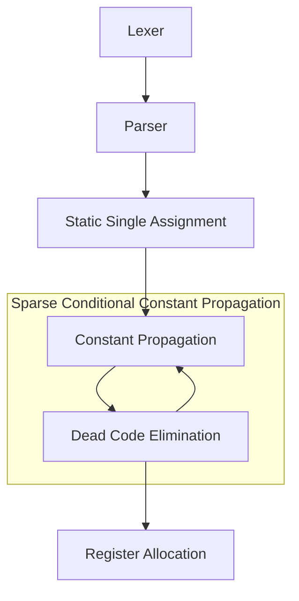

# USM - The Universal Assembly Language

One Universal assembly language to rule them all.

## Language Specification

### Registers

A register is a location that can store values of a certain type.
Registers are defined and bounded to the context of a single function.
The first assignment of the register to a value (possibly, as a function parameter)
defines the register type, and the type of the register cannot be changed
afterwards. A register type can be any valid type, and the size of the register
(in bits) is unbounded.

Unlike in other, machine specific, assembly languages, the number of available
registers are not bounded by USM, and their names can be any sequence of non
whitespace[^1] unicode characters, prefixed by `%`.

[^1]: A unicode whitespace character is one that has the ["WSpace=Y" property](https://en.wikipedia.org/wiki/Whitespace_character#Unicode). For reference, see [Go's unicode.IsSpace standard function](https://pkg.go.dev/unicode#IsSpace).

Registers are not necessarily stored in memory, and thus can't be directly
dereferenced.
