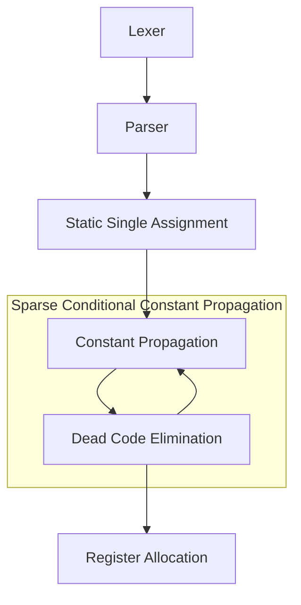

# USM - The Universal Assembly Language

One Universal assembly language to rule them all.

```mermaid
graph TD;
    LEX[Lexer]
    PRS[Parser]
    SSA[Static Single Assignment];
    CP[Constant Propagation];
    DCE[Dead Code Elimination];
    RA[Register Allocation];

    subgraph "Sparse Conditional Constant Propagation"
        CP
        DCE
    end

    LEX --> PRS;
    PRS --> SSA;
    SSA --> CP;
    CP --> DCE;
    DCE --> CP;
    DCE --> RA;
```
