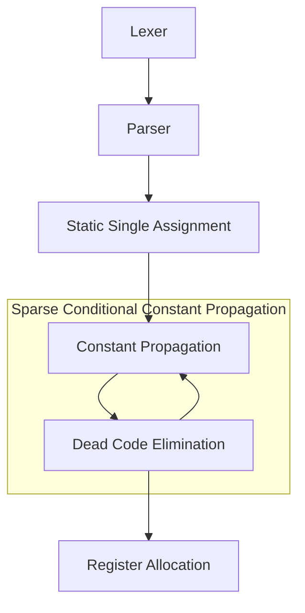

# USM - The Universal Assembly Language

[](https://github.com/RealA10N/usm/actions/workflows/ci.yml)
[](https://codecov.io/gh/RealA10N/usm)

One Universal assembly language to rule them all.

Key aspects:

- There is no importance to the order of top level declarations.



## Language Specification

### Registers

A register is a location that can store values of a certain type.
Registers are defined and bounded to the context of a single function.
The first assignment of the register to a value (possibly, as a function parameter)
defines the register type, and the type of the register cannot be changed
afterwards. A register type can be any valid type, and the size of the register
(in bits) is unbounded.

Unlike in other, machine specific, assembly languages, the number of available
registers are not bounded by USM, and their names can be any sequence of non
whitespace[^1] unicode characters, prefixed by `%`.

[^1]: A unicode whitespace character is one that has the ["WSpace=Y" property](https://en.wikipedia.org/wiki/Whitespace_character#Unicode). For reference, see [Go's unicode.IsSpace standard function](https://pkg.go.dev/unicode#IsSpace).

Registers are not necessarily stored in memory, and thus can't be directly
dereferenced.

### Immediate Values

Immediate values are used to initialize registers and globals.

#### Integer Immediate Value

Initialize an integer value using the syntax `#<n><b>` where `<b>` is replaced
with the immediate base (as described below), and `<n>` is replaced with a
possibly negative integer, in the provided base representation (as described
below).

| Base             | Allowed Suffix (`<b>`) | Allowed Digits (`<n>`)      |
|------------------|------------------------|-----------------------------|
| Hexadecimal (16) | `h` or `H`             | `0`-`9`, `a`-`f` or `A`-`F` |
| Decimal (10)     | empty, `d` or `D`      | `0`-`9`                     |
| Octal (8)        | `o` or `O`             | `0`-`7`                     |
| Binary (2)       | `b` or `B`             | `0`, `1`                    |

For reference, consider the following example.

```usm
func @main =
    %0 = $32 #-1337
    %1 = $32 #4294967295
    %2 = $64 #DEADBEEFh
    %3 = $32 #-1234567o
    %4 = $8 #100b
```

#### Character Immediate Value

For convenience, an initialization of integers can be also done via a unicode
character. Using the syntax `#'<c>'`, where `<c>` is replaced by a unicode
character, the immediate value will be translated to the appropriate [unicode
code point](https://en.wikipedia.org/wiki/Code_point#In_Unicode).

#### Pointer Immediate Value

A pointer type can be only explicitly initialized to the zero immediate `#0`
(or to a global with the same type).

### Globals

It is possible to declare a global without initialization. In that case the
initial value of the global is undefined.

```usm
global $person @author  ; undefined value
```

#### Global Initialization

Global initialization is done by initializing the global underlying standard types,
in order of declaration of the global type. The initialization should be provided after the declaration of the global and the `=` token.

If not all fields of the global are initialized (possibly, none), the
uninitialized fields are implicitly initialized to zero.

```usm
global $32 @authorAge = #1337

global $8 ^5 @authorName = #'A' #'l' #'o' #'n'

global $person @author =
    @authorName
    @authorAge            ; .isMale is implicitly initialized to #0
```

Using type labels, it is possible to start initialize fields from a different
starting position, and skip explicit initialization of fields to zero.

```usm
global $person @author =  ; the .name field is initialized to #0 implicitly.
    .age @authorAge       ; initialization is started from .age field
    #1                    ; and continues to the .isMale field
```

Note that it is possible to implicitly initialize all of the fields to `#0`,
but simply appending the `=` token after the global declaration.

```usm
global $person @author =
```

If a type field is initialized more than once, the value of the whole structure
is undefined (that is, including other fields).
